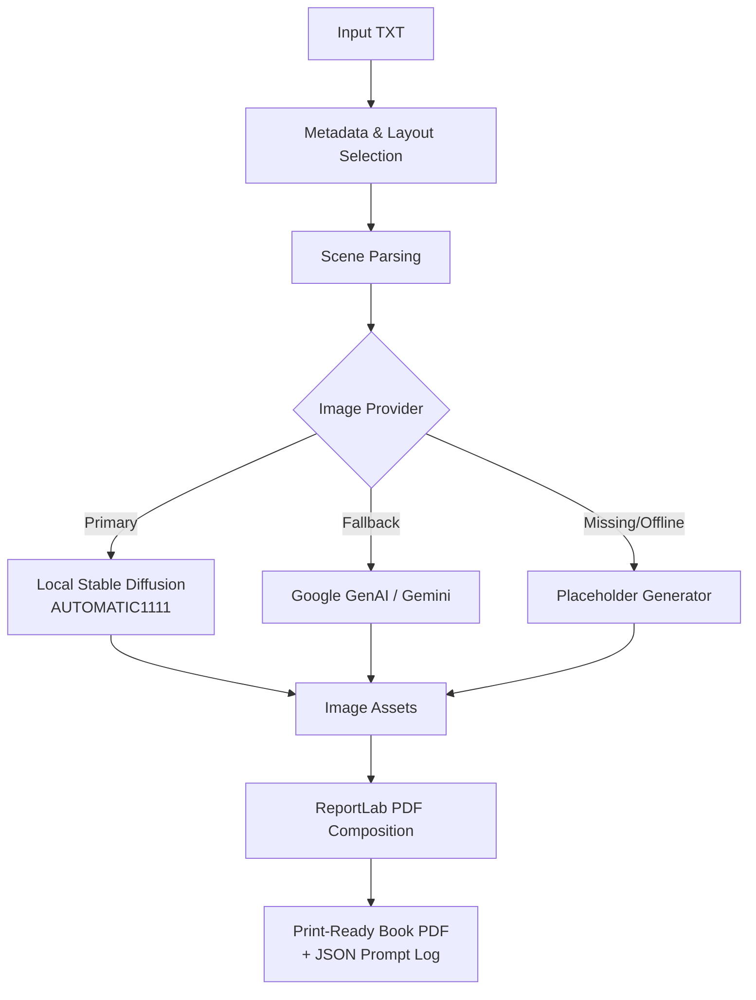
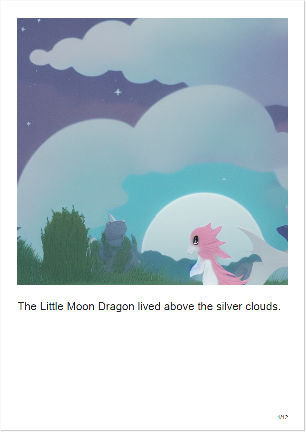
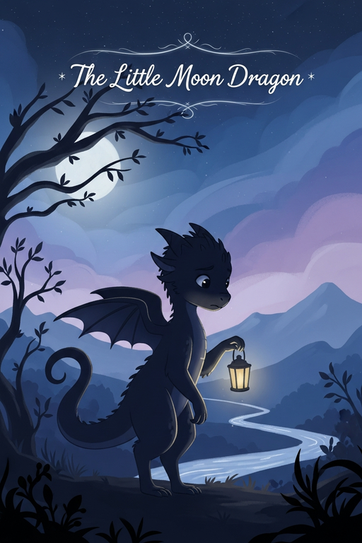
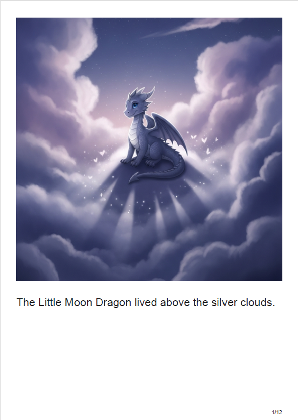
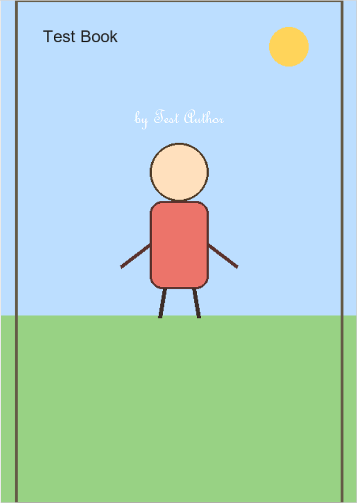
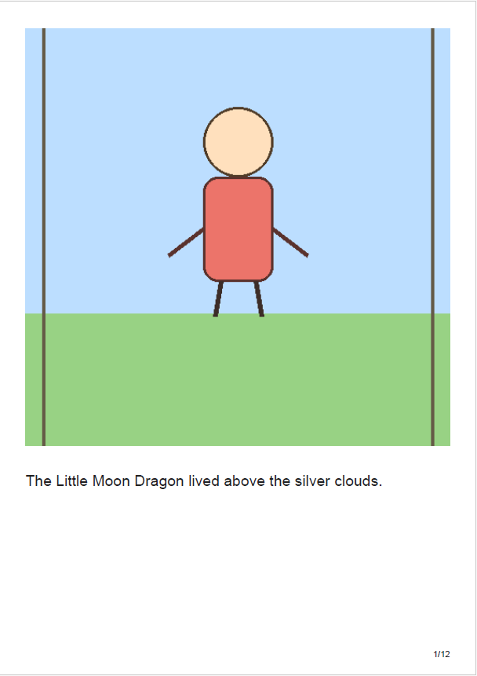

# 📖 AI Storybook Generator


**AI Storybook Generator** is an automated pipeline that transforms a plain text story or poem into a beautifully illustrated, print-ready children's book PDF. 

This project was developed as a portfolio showcase demonstrating the integration of local AI image generation models with document automation in Python.

---

## ✨ Features

- **End-to-End Pipeline**: From a raw `.txt` file to a final `.pdf` without manual layout.
- **Smart Scene Extraction**: Automatically breaks down text into logical scenes for illustration.
- **Action-Driven Prompts**: Dynamically structures image generation prompts so that Stable Diffusion accurately captures the *action* of each scene.
- **Consistent Characters**: Uses tailored prompts and seed management to keep the main character visually consistent across pages.
- **Dynamic Layout Options**: Choose to place text beneath the illustration or use a split-page layout for longer texts (auto-detect available to prevent text/image overlap).
- **Smart Fallback System**: Seamlessly switches to Google GenAI / Gemini Imagen API (with privacy consent) or generates placeholder images if the user doesn't have a local Stable Diffusion server installed.
- **Interactive Review & Refining Loop**: Features a dedicated character design approval phase before generating the full book, and a post-generation review step to adjust layouts, edit styles, or re-render specific pages on the fly.

## 🛠️ Architecture & Workflow



## 🚀 Prerequisites

- **Python 3.10.x**
- [**stable-diffusion-webui**](https://github.com/AUTOMATIC1111/stable-diffusion-webui) by AUTOMATIC1111 (for local generation)
- *Optional:* Google Gemini API Key (`GEMINI_API_KEY` or `GENAI_API_KEY`) for cloud fallback image generation

## 📦 Installation

1. **Clone this repository:**
   ```bash
   git clone https://github.com/your-username/ai_storybook_generator.git
   cd ai_storybook_generator
   ```

2. **Create a virtual environment & install dependencies:**
   ```powershell
   python -m venv .venv
   .\.venv\Scripts\Activate.ps1
   pip install -r requirements.txt
   ```

## ⚙️ Configuration

### 1. Local Stable Diffusion (Recommended)
This tool relies on the popular [AUTOMATIC1111 stable-diffusion-webui](https://github.com/AUTOMATIC1111/stable-diffusion-webui) repository for image generation. To enable it:
1. Run your WebUI with the `--api` flag enabled:
   ```bash
   webui-user.bat --api
   ```
2. The script connects to `http://127.0.0.1:7860` by default.

### 2. Gemini / Google GenAI Fallback (Optional)
If you prefer cloud generation (using Google's Imagen model) or your local GPU is busy, set your API key:
```powershell
$env:GEMINI_API_KEY="your-api-key-here"
# or
$env:GENAI_API_KEY="your-api-key-here"
```

## 📚 Usage

Run the script and follow the interactive prompts:

```bash
python book_maker.py --input-file sample_input/sample_story.txt
```

You will be asked to:
1. Provide the book title, author, and main character details.
2. Select an illustration style (e.g., Watercolor, Dreamy, Modern).
3. Choose the page layout (Text below image vs. Separate pages).
4. Review extracted scenes and generation parameters.
5. **Character Approval Phase**: Inspect the generated character sheet and choose to adjust the description, seed/style, or proceed.
6. **PDF Review Loop**: Once generated, view the output book and selectively re-generate pages or fine-tune layout/fonts without rebuilding from scratch.

### CLI Arguments
- `--book-format`: Choose `a4`, `a5`, or `square`.
- `--fallback-provider`: `auto`, `gemini`, or `placeholder`.
- `--gemini-api-key`: Pass the Gemini key directly (or set `GEMINI_API_KEY` env var).
- `--gemini-image-model`: Specify the Imagen model (defaults to `imagen-4.0-generate-001`).
- `--placeholders`: Skip AI generation and generate dummy images for fast layout testing.
- `--allow-placeholder-fallback`: Automatically use placeholders if the SD API is unreachable.

## 📁 Output

The generated files are saved in the `output/` directory:
- `images/` - Individual scene illustrations and cover art.
- `<title>_print_ready.pdf` - The final book.
- `<title>_generation_prompts.json` - A detailed log of settings and prompts used, enabling exact reproduction.

## 🤝 Acknowledgments

Special thanks to the open-source AI community and [AUTOMATIC1111](https://github.com/AUTOMATIC1111) for providing the accessible and powerful `stable-diffusion-webui` which serves as the core creative engine for this tool.

---

## 📸 Previews

### 1. Local Stable Diffusion (IP-Adapter Character Consistency)
*Here are examples of the book layout generated with Stable Diffusion:*

<p align="center">
  
  &nbsp;&nbsp;&nbsp;&nbsp;
  
</p>

### 2. Google Gemini / Imagen Cloud Fallback
*Here are examples of the book layout generated with Google Gemini cloud fallback:*

<p align="center">
  
  &nbsp;&nbsp;&nbsp;&nbsp;
  
</p>

### 3. Placeholder Mode (Fast Testing / Manual Illustration Import)
*Here are examples of the book layout using the fast, local placeholder mode:*

<p align="center">
  
  &nbsp;&nbsp;&nbsp;&nbsp;
  
</p>
