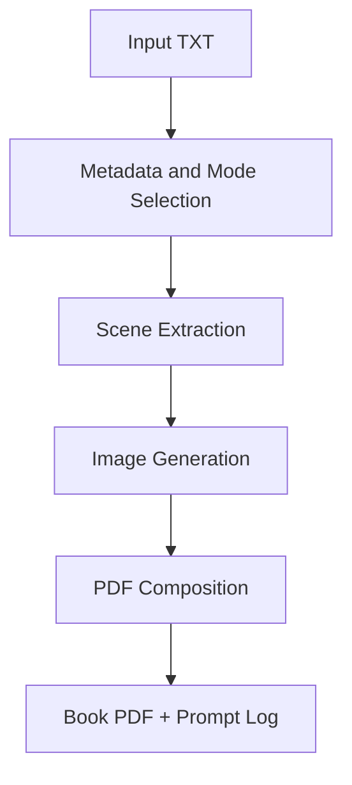
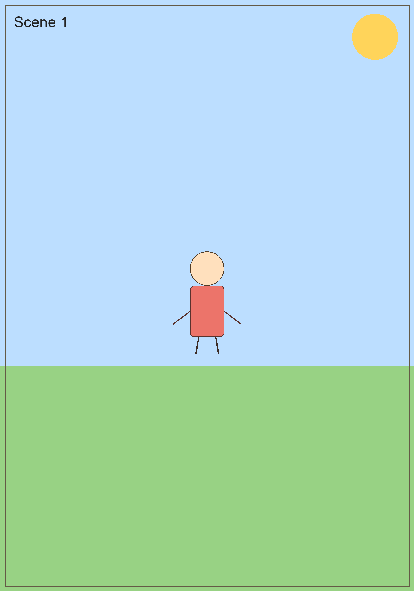

# AI Storybook Generator

Generate an illustrated, print-ready children book PDF from a plain text file.

This project is a local-first publishing pipeline that combines text processing, image generation, and PDF composition into one script.

## Overview

AI Storybook Generator takes a story, song, or poem and produces:

- A cover image
- One or more scene illustrations
- A print-ready PDF book
- A JSON prompt log for reproducibility

The default generation strategy is:

1. Local Stable Diffusion via Automatic1111 API
2. OpenAI Images API fallback (optional)
3. Local placeholder illustrations

## Feature Highlights

- Story mode and song/poem mode
- Scene extraction from paragraphs, lines, or sentences
- Style presets for consistent character rendering
- Cover generation and per-scene page layout
- Song/poem text rendering across dedicated text pages
- Prompt logging for auditability and repeatability

## Architecture

Core flow:



Main responsibilities in book_maker.py:

- CLI and interactive prompts
- Scene parsing and mode-specific behavior
- Image generation clients and fallback routing
- Cover and page rendering with ReportLab
- Output asset and metadata persistence

## Requirements

- Windows, macOS, or Linux
- Python 3.10.x recommended
- Pip
- Optional local backend: Automatic1111 Stable Diffusion WebUI with API enabled
- Optional fallback backend: OpenAI API key

Python packages are listed in requirements.txt:

- requests
- Pillow
- reportlab

## Installation

1. Clone repository.
2. Create and activate a virtual environment.
3. Install dependencies.

Windows PowerShell:

```powershell
python -m venv .venv
.\.venv\Scripts\Activate.ps1
pip install -r requirements.txt
```

## Configure Image Backends

### Local Stable Diffusion (Primary)

Run Automatic1111 WebUI with API enabled, commonly with:

```bash
webui-user.bat --api
```

Default API URL expected by this project:

- http://127.0.0.1:7860

You can change it with:

- --sd-base-url

### OpenAI Images (Optional Fallback)

Set API key in environment:

Windows PowerShell:

```powershell
$env:OPENAI_API_KEY="your_key_here"
```

## Quick Start

Run with a text input file:

```bash
python book_maker.py --input-file sample_input/sample_story.txt
```

The script then asks for title, author, age group, main character, content type, style, and confirmation of extracted scenes.

## Usage Patterns

Auto fallback chain (local SD -> OpenAI -> placeholder):

```bash
python book_maker.py --input-file sample_input/sample_story.txt --fallback-provider auto
```

Force OpenAI fallback mode:

```bash
python book_maker.py --input-file sample_input/sample_story.txt --fallback-provider openai
```

Allow placeholder fallback without interruption:

```bash
python book_maker.py --input-file sample_input/sample_story.txt --allow-placeholder-fallback
```

Generate placeholders only:

```bash
python book_maker.py --input-file sample_input/sample_story.txt --placeholders
```

## CLI Options

Common options:

- --input-file: path to UTF-8 .txt source file
- --book-format: a4, a5, square
- --output-dir: output directory (default: output)
- --max-scenes: scene/page cap
- --sd-base-url: local Automatic1111 API URL
- --image-width, --image-height: generation dimensions
- --steps, --cfg-scale, --sampler, --seed: generation controls
- --fallback-provider: placeholder, openai, auto
- --openai-api-key: OpenAI key override
- --openai-image-model: OpenAI image model name
- --allow-placeholder-fallback: non-blocking fallback when local SD is unavailable

## Output Structure

Default output directory:

- output/images/scene_XX.png
- output/images/cover.png
- output/<title>_print_ready.pdf
- output/<title>_generation_prompts.json

## Data Privacy and Handling

- Local Stable Diffusion mode keeps story text and prompts on your machine.
- OpenAI fallback mode sends prompts to OpenAI for image generation.
- Prompt logs are stored locally in JSON for traceability.

## External Services and Attribution

This project integrates with third-party tools and APIs:

- Automatic1111 Stable Diffusion WebUI API (primary local image backend)
- OpenAI Images API (optional fallback backend)

Project boundaries:

- This repository provides orchestration, prompt construction, scene logic, and PDF rendering.
- Generation quality and behavior depend on selected model/backend.
- This project is not affiliated with or endorsed by Automatic1111 or OpenAI.

## Reproducibility Notes

- Use a pinned Python 3.10.x environment for stable local setup.
- Keep the same seed and generation settings when comparing runs.
- Store generated prompt logs with output assets.

## Troubleshooting

Local SD API unavailable:

- Confirm Automatic1111 is running with API enabled.
- Check API URL and port with --sd-base-url.
- Use --allow-placeholder-fallback if you want generation to continue.

OpenAI fallback not used:

- Ensure OPENAI_API_KEY is set or pass --openai-api-key.
- Confirm --fallback-provider is openai or auto.

Blank or missing output pages:

- Verify source text file is valid UTF-8 and not empty.
- Check generated images in output/images before PDF stage.

## Roadmap

- Modularize the single-file script into focused packages
- Add automated tests for extraction and page layout
- Add localization support for prompt language
- Improve cross-page character consistency
- Add optional desktop or web UI

## Preview

Cover example:


Interior page example:


