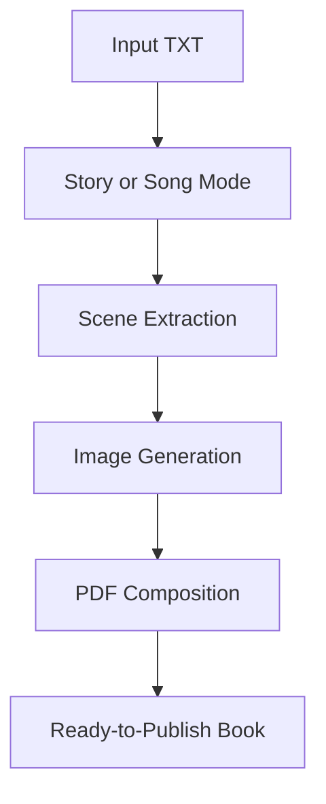

# AI Storybook Generator

AI-assisted workflow that transforms a text file into a publication-ready illustrated PDF book.

AI-assisted publishing workflow for generating illustrated, print-ready children's books from plain text files.

Designed as a local-first creative automation pipeline combining Python, AI image generation, and PDF publishing workflows.

## Features

- AI-generated illustrations
- Story and song/poem modes
- Scene extraction and per-scene image generation
- Cover generation
- Print-ready PDF output
- Automatic fallback chain: local Stable Diffusion -> OpenAI Images -> placeholders
- Prompt logging to JSON for reproducibility

## Project Goals

- Turn plain text into a complete illustrated book with minimal setup.
- Keep the workflow simple for non-technical users.
- Produce print-ready output suitable for sharing or publishing.
- Keep generation reproducible through prompt logging.

## Local-First Design

The workflow is designed to work locally whenever possible.

Story text does not need to leave the user's machine when using a local Stable Diffusion backend.

Fallback behavior:

- Primary: local Stable Diffusion (Automatic1111 API)
- Secondary: OpenAI Images API (optional)
- Final: local placeholder illustrations

## Interactive Questions

When you run the script, it asks in English:

- Book title
- Author
- Age group
- Main character name
- Main character type
- Is this a story or a song/poem? (story/song)
- If song/poem: one illustration for full text or multiple per scene? (one/multiple)

This flow is designed to avoid duplicated text in the PDF.

## PDF Text Behavior (Important)

- Story mode:
    - No full-text song page is added.
    - Scene text appears on scene pages.
- Song/poem mode:
    - Full song/poem text is rendered in dedicated text page(s).
    - Scene pages are image-focused (no repeated scene text).
- Placeholder images are text-free, so they do not duplicate text visually.

## Tech Stack

- Python
- Requests
- Pillow
- ReportLab
- OpenAI API
- Automatic1111 Stable Diffusion WebUI API

## Workflow



## Architecture

Main components in book_maker.py:

- Input and CLI: collects metadata, mode selection, and validation.
- Scene processing: extracts scenes and supports one-or-multiple illustration logic for songs/poems.
- Image generation: local Automatic1111, OpenAI fallback, or local placeholders.
- PDF composition: builds cover, text pages, and scene pages according to selected mode.
- Output logging: writes images, final PDF, and prompt JSON logs.

## Install

```bash
pip install -r requirements.txt
```

## Run

Basic run:

```bash
python book_maker.py --input-file story.txt
```

## Fallback Options

Auto mode (default): local SD -> OpenAI -> placeholder

```bash
set OPENAI_API_KEY=your_key_here
python book_maker.py --input-file story.txt --fallback-provider auto
```

Use placeholder fallback when local SD is unavailable:

```bash
python book_maker.py --input-file story.txt --fallback-provider placeholder --allow-placeholder-fallback
```

Use OpenAI Images as fallback provider:

```bash
set OPENAI_API_KEY=your_key_here
python book_maker.py --input-file story.txt --fallback-provider openai
```

## Output

Generated files are written to output by default:

- output/images/scene_XX.png
- output/images/cover.png
- output/<title>_print_ready.pdf
- output/<title>_generation_prompts.json

## Future Improvements

- Split the script into modules (CLI, generation, PDF, utilities).
- Add automated tests for scene extraction and PDF text layout rules.
- Add optional localization for interactive prompts.
- Add stronger character consistency controls across scenes.
- Add layout presets for different publishing targets.
- Add an optional desktop or web UI.

## Preview

### Cover Example


### Interior Page Example


